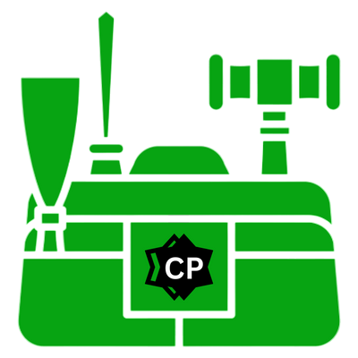

  

linting
comments
documentation (installation guide, python version, internet required)
static typing
virtual env and requirements.txt

auto compile on file change auto start with logging (watchman.py)
check if output matched real output (judge.py) -> Show time taken

if corresponding .out file now found for input file leave the expected result (may do with shell) might provide inside folder(coding) for easy use -> maybe diff using shell will compile and check diff
If this is done then watchman.py might not be needed

pip freeze > requirements.txt

pip install -r requirements.txt

add dbrun.py cli tool to run from cli  {input -> (case insensitive)}

add drawio roadmap
new plugin system
